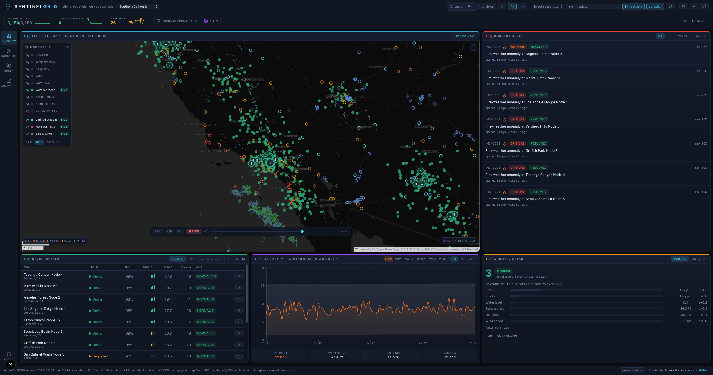
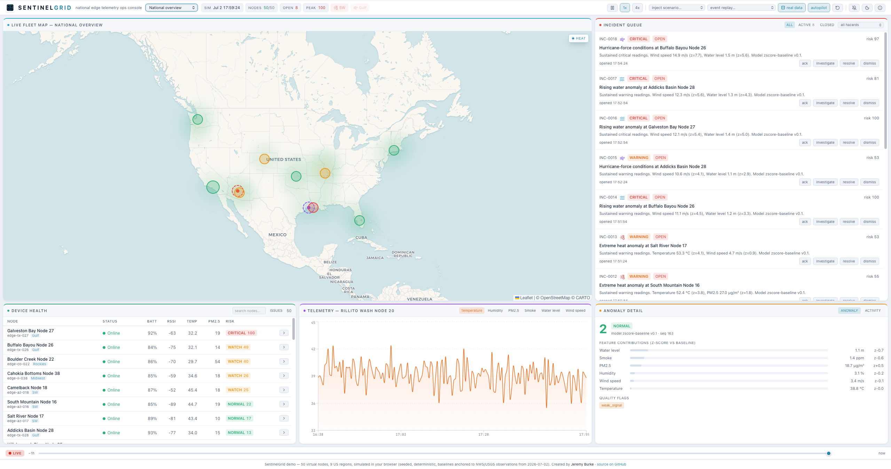

# SentinelGrid

SentinelGrid is a local-first edge telemetry platform for climate-risk monitoring. It uses virtual sensor nodes instead of physical hardware, then builds the same kind of software surface a real system would need: MQTT ingestion, geospatial storage, anomaly scoring, data-quality checks, and a national operations console — overlaid with genuinely live public data (NEXRAD radar, ~3,700 real NWS/USGS stations, active warning polygons, earthquakes).

**Live demo:** [sentinelgrid-two.vercel.app](https://sentinelgrid-two.vercel.app) · created by Jeremy Burke
**Reviewing the code?** Start with [docs/REVIEWERS.md](docs/REVIEWERS.md) — a ten-minute tour of the architecture, the design decisions worth interrogating, and what the tests prove. In the app, press `?` for the feature guide or run the 60-second guided demo.



<details>
<summary>Light theme</summary>



</details>

## Dashboard highlights

- **Two-tier simulated fleet** — 150 flagship stations (full history, drift
  quarantine, incidents) + a 3,000-node procedural mesh (population-weighted
  around real metros, stateless: history regenerates deterministically on
  demand). ~46k readings/min, tick cost ~3 ms, CI-gated.
- **Real data next to the sim, never blended with it** — live NEXRAD radar,
  ~2,300 NWS/ASOS weather stations + ~1,400 USGS stream gauges (refreshed by
  CI, weather stations z-scored against regional baselines, gauges honestly
  unscored), live NWS storm-based warning polygons, and past-day earthquakes.
  Real layers are LIVE-badged and solid; simulated overlays stay dashed.
- **Zoom-driven map** — scroll in and the nearest region auto-selects, scroll
  out for the national view; layers panel, satellite basemap, fullscreen,
  playback scrubber docked on the map with -24h/-6h/-1h jumps.
- **Honest analytics** — anomaly fingerprint radar + hazard pattern matching,
  telemetry with a reconstructed baseline ±2σ corridor, a rule-based
  situation summary with response playbooks, an event-decay forecast, and a
  model-confidence panel synthesized from observable scoring state. Every
  number on screen derives from the model — nothing is decorative.
- **Ops ergonomics** — ⌘K command palette over 3,150+ nodes/regions/actions,
  saved views with copyable share links, full UI state in the URL hash,
  printable situation reports, keyboard shortcuts, dual theme.
- **Physics with siting** — coastal nodes feel surge, ridges feel wind,
  washes flood, forests smoke; diurnal baselines run on region-local time.

The project is intentionally designed around free tools:

- C++ edge-device simulator
- MQTT with Mosquitto
- FastAPI backend
- PostgreSQL with PostGIS
- MinIO for S3-compatible local object storage
- Python worker jobs for replay, scoring, and data quality
- Next.js dashboard with Leaflet/OpenStreetMap and charts
- Docker Compose for local development
- GitHub Actions for CI

## Repository Layout

```text
sentinelgrid/
  edge-sim/        C++ virtual edge-device publisher
  api/             FastAPI ingestion and query API
  worker/          replay, anomaly scoring, and data-quality jobs
  web/             Next.js dashboard
  infra/           Docker Compose, Mosquitto, Postgres, MinIO config
  db/              migrations and seed data
  docs/            architecture and design notes
  scripts/         developer helper scripts
```

## Architecture

```text
Virtual sensor nodes
  edge-sim C++
      |
      | MQTT: sentinelgrid/v1/devices/{device_id}/telemetry
      v
Mosquitto broker
      |
      v
FastAPI ingest API  ---> PostgreSQL/PostGIS
      |                       ^
      v                       |
Worker jobs ------------------+
      |
      v
MinIO raw archives

Next.js dashboard ---> FastAPI query endpoints ---> PostgreSQL/PostGIS
```

## Two Ways to Run It

**Hosted demo (sim mode).** `web/` is the operator dashboard, deployable as a
static site with zero backend: a deterministic in-browser engine simulates
3,150 virtual nodes (150 flagship + 3,000 mesh) across 16 US regions, scores
anomalies with the same z-score model as the worker, and drives the incident
queue. Baselines anchor to real NWS/USGS observations refreshed daily by CI,
and the verified-stations snapshot (~3,700 real stations) refreshes four
times a day.

```sh
cd web
npm install
npm run dev        # local dev at http://localhost:3000
npm run build      # static export in web/out/ — deploy to any static host
```

See `web/README.md` for deployment options (Vercel, Netlify, GitHub Pages, or
a subpath of an existing site via `NEXT_PUBLIC_BASE_PATH`).

**Full local stack (live mode).** The real pipeline: the C++ `edge-sim` fleet
publisher → MQTT bridge → Mosquitto → FastAPI ingest → Postgres/PostGIS →
Python worker scoring/incidents → the same dashboard pointed at the API.

```sh
make stack-up      # postgres + mosquitto + minio + api (:8000) + worker
make bridge-run    # edge-sim fleet publisher piped into the MQTT bridge
# dashboard against the live API:
cd web && NEXT_PUBLIC_DATA_MODE=live NEXT_PUBLIC_API_URL=http://localhost:8000 npm run dev
```

API docs at http://localhost:8000/docs. `make stack-down` to stop.

The broker requires authentication (dev credentials `sentinelgrid` /
`sentinelgrid`, hashed in `infra/mosquitto/passwd`; regenerate with
`make mosquitto-passwd`). The bridge and API pick them up from
`MQTT_USERNAME` / `MQTT_PASSWORD` (same defaults).

### API extras

- `GET /stream` — Server-Sent Events; a `snapshot` event (same shape as
  `/snapshot`) every ~2s (`SENTINELGRID_STREAM_INTERVAL_S`).
- `GET /metrics` — Prometheus metrics: ingest counters (HTTP + MQTT), HTTP
  request counts, and scoring lag.
- Optional auth: set `SENTINELGRID_API_KEY` and the write endpoints
  (`POST /ingest/telemetry`, `PATCH /incidents/{id}`) require a matching
  `X-API-Key` header. Reads stay open.
- Rate limiting: per-client-IP sliding window,
  `SENTINELGRID_RATE_LIMIT_PER_MIN` (default 600, `/health` exempt).
- JSON logs: `SENTINELGRID_LOG_JSON=1` (API and worker).

### Worker jobs

Every cycle: z-score scoring (against learned per-device baselines once a
device/metric has 300+ normal samples — see `device_baselines`), an
IsolationForest second opinion stored in `anomaly_scores.model_scores`,
incident lifecycle, and sequence data-quality checks. Every
`SENTINELGRID_MAINTENANCE_INTERVAL_S` (default 300s): hourly rollups into
`telemetry_rollup_1h`, raw-telemetry retention
(`SENTINELGRID_RETENTION_DAYS`, default 7, `0` disables), and gzipped-NDJSON
archival to MinIO recorded in `raw_archives` with sha256 checksums.

Backtest the scoring models against labeled anomaly windows:

```sh
make backtest      # sample data in worker/data/
```

### Database migrations

Fresh compose volumes bootstrap from `infra/db/init/*.sql`. Existing
databases evolve with Alembic (`db/alembic/`, DSN from `DATABASE_URL`):

```sh
make db-stamp      # once, on a DB bootstrapped by the init scripts
make db-upgrade    # apply new revisions
make db-revision m="add foo table"
```

New DDL lands in both places: an idempotent `infra/db/init/NNN_*.sql` for
fresh volumes and a matching Alembic revision for existing databases.

## Fleet

Two simulated tiers: 150 hand-placed flagship nodes with full history,
incidents, and drift-quarantine state, plus a 3,000-node procedural mesh
(population-weighted around real metros; latest reading only, history
regenerated deterministically on demand) that gives the national map its
density. Flagships span 16 regions (Southern California, Northern California,
Pacific Northwest, Desert Southwest, Great Basin & Wasatch, Colorado Front
Range, Texas Triangle, Gulf Coast, Florida Peninsula, Carolinas & Georgia,
Mississippi Valley, Southern Plains, Upper Midwest, Great Lakes, Mid-Atlantic,
Northeast Corridor), each with region-appropriate hazard profiles: wildfire,
flood, hurricane, extreme heat, tornado, winter storm, air quality. Devices are seeded from `db/seeds/devices.json`, which is
the shared source of truth for the browser sim, the C++ publisher, and the
database.

## Local Commands

```sh
make check
make edge-run          # build and run the C++ fleet publisher (stdout NDJSON)
make infra-up          # infra only: postgres, mosquitto, minio
make stack-up          # infra + api + worker
make bridge-run        # edge-sim | scripts/mqtt_bridge.py
make api-test          # api unit tests
make worker-test       # worker unit tests (scoring model)
```

`make infra-up`/`make stack-up` start only free local services. Nothing here
creates cloud resources.

